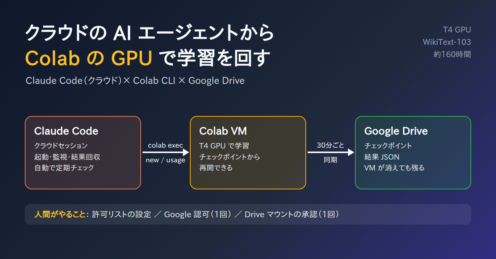
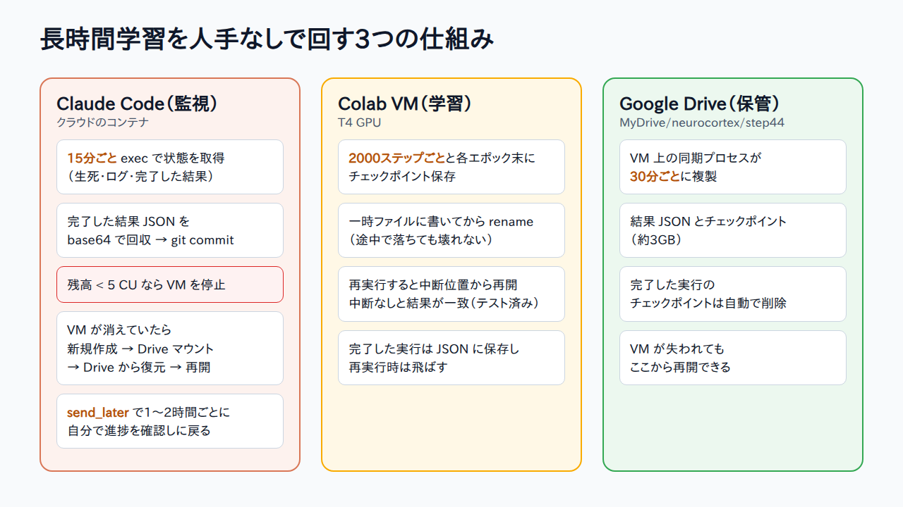

# Claude Code のクラウドセッションから Colab CLI で GPU 学習を回す



ローカルに GPU がなく、Colab をブラウザで操作する時間もない。そこで、Claude Code のクラウドセッション（claude.ai/code）から Google 公式の Colab CLI を使い、Colab の T4 GPU での学習の起動・監視・結果回収までを AI エージェントに任せてみました。この記事では、その手順と、途中でつまずいた点をまとめます。

題材は、研究中の脳型言語モデル（neurocortex-llm）の再実験です。768次元・12層のモデルを WikiText-103 で学習させます。

## 構成

- 操作する側: Claude Code のクラウドセッション。GitHub リポジトリを取り込んだ使い捨てのコンテナで、GPU はありません。
- 学習する側: Colab の VM（T4 GPU）。Colab Pro のコンピューティングユニット（CU）を消費します。
- 橋渡し: Colab CLI（`google-colab-cli` 0.7.4）。コンテナ内から VM の作成、コード実行、Drive のマウント、残高確認ができます。
- 保存先: Google Drive。VM が失われても学習を再開できるよう、チェックポイントを置きます。

人間がやったのは、次の3つだけです。

1. クラウド環境の許可リストにドメインを追加する
2. ブラウザで Google の認可画面を開いて承認し、表示されたコードを貼る
3. Drive マウントの承認画面で承認する

## 1. ネットワークの許可リスト

Claude Code のクラウド環境は、外向きの通信が許可リストで制限されています。環境の設定で、次のドメインを追加しました。

- `colab.research.google.com`（CLI の API とブラウザ認可）
- `*.prod.colab.dev`（VM のカーネルとの通信。これがないと `exec` が失敗する）
- HuggingFace のドメイン（VM 側ではなく、コンテナ側でデータセットを扱う場合）

Google の OAuth 関連（`accounts.google.com` や `oauth2.googleapis.com` など）が通らない場合は、同様に追加します。

## 2. Colab CLI のインストール

Colab CLI は Python 3.12 以上が必要です。コンテナの Python が古い場合は、`uv` を使えば、専用の Python ごと入ります。

```
uv tool install google-colab-cli
export PATH=~/.local/bin:$PATH
colab version
```

## 3. 認証（OAuth）

最初に CLI を実行すると、認可用の URL が表示され、`Enter the authorization code:` と入力を求められます。

- エージェントが URL をチャットに貼り、人間がブラウザで開いて承認します。
- 承認後に表示されるコードを、人間がチャットに貼ります。
- エージェントが CLI の標準入力にコードを渡します。コンテナには端末がないので、名前付きパイプ（fifo）を用意して、そこから流し込みました。

```
mkfifo colab_in
(sleep 3600 > colab_in &)          # パイプを開いたままにする
colab --auth oauth2 usage < colab_in > auth.log 2>&1 &
# auth.log に出た URL を人間が開いて承認し、コードを受け取ったら:
printf '%s\n' "<認可コード>" > colab_in
```

トークンは `~/.config/colab-cli/token.json` に保存され、以後はブラウザ操作なしで使えます。

**注意（セキュリティ）**

- このトークンは、あなたの Google アカウントで Colab と Drive を操作できる権限を持ちます。リポジトリには絶対にコミットしないでください（`~/.config` はリポジトリの外です）。
- Google のパスワードそのものは、コンテナに置く必要はありません。
- 使い終わったら、Google アカウントの「セキュリティ」→「サードパーティ製のアプリとサービス」から、アクセス権を取り消せます。
- Claude Code は、認証情報をファイルに書き込むような操作の前に確認を求めてきます。自分のアカウントのトークンを置いてよいかを、自分で判断して許可してください。

## 4. VM の作成と実行

```
colab --auth oauth2 new -s step44 --gpu T4      # セッション作成
colab --auth oauth2 exec -s step44 -f cell.py   # Python ファイルをセルとして実行
colab --auth oauth2 usage                       # 残高と消費レート
colab --auth oauth2 sessions                    # セッション一覧
colab --auth oauth2 stop -s step44              # 停止（CU の消費が止まる）
```

`exec` は、ノートブックの1セルを実行するのと同じです。長時間の学習は、セルの中で `subprocess.Popen(..., start_new_session=True)` を使ってバックグラウンドで起動し、PID とログをファイルに残します。こうすると、`exec` がすぐ返るので、あとから別の `exec` で状態を確認できます。

```python
# cell.py（学習の起動）
import subprocess
p = subprocess.Popen(
    ["python", "train.py", "--epochs", "4"],
    cwd="/content/neurocortex-llm",
    stdout=open("/content/step44/run.log", "a"), stderr=subprocess.STDOUT,
    start_new_session=True,
)
open("/content/step44/pid", "w").write(str(p.pid))
print("started", p.pid)
```

## 5. つまずいた点と回避策

### ファイル転送のコマンドが使えなかった

CLI 0.7.4 の `download` / `upload` / `ls` は、数バイトのファイルでもサーバーが 500 を返しました。

- 回避策: 小さな結果ファイル（JSON）は、`exec` の中で base64 にして標準出力に出し、コンテナ側で復元する。
- 大きなファイル（チェックポイント 約3GB）は、Drive 経由にする。

### Drive マウントが端末を要求する

`colab drivemount` は、認可 URL を表示したあと、「承認したら Enter を押して」と `/dev/tty` から入力を待ちます。クラウドのコンテナには端末がないので、承認前に読み取りが終わってしまい、マウントに失敗しました（`ValueError: mount failed`）。

回避策として、`/dev/tty` の読み取りだけを「承認が完了するまでポーリングする処理」に差し替える小さなラッパーを書きました。CLI の内部実装に依存するため、バージョンが変わると動かない可能性があります。

```python
# colab_dm.py: python colab_dm.py --auth oauth2 drivemount -s <セッション名>
# uv で入れた CLI の Python で実行する（~/.local/share/uv/tools/google-colab-cli/bin/python）
import json, sys, time, io
from colab_cli.commands import automation
from colab_cli.auth import get_credentials
from colab_cli.utils import get_status_code

SESSION = sys.argv[sys.argv.index("-s") + 1]

class _Poll(io.StringIO):
    def readline(self, *a):
        from colab_cli.common import state
        s = state.get_session(SESSION)
        url = f"{state.client.colab_domain}/tun/m/credentials-propagation/{s.endpoint}"
        params = {"authuser": "0", "authtype": "dfs_ephemeral", "version": "2",
                  "dryrun": "false", "propagate": "true", "record": "false"}
        deadline = time.time() + 1500
        while time.time() < deadline:
            time.sleep(10)
            creds = get_credentials(state.client_oauth_config, provider=state.auth_provider)
            r = creds.request("GET", url, params=params)
            tok = json.loads(r.text.split("\n", 1)[-1]).get("token") if get_status_code(r) == 200 else None
            r = creds.request("POST", url, params=params, headers={"x-goog-colab-token": tok},
                              files={"file_id": (None, "empty.ipynb")})
            if get_status_code(r) == 200 and json.loads(r.text.split("\n", 1)[-1]).get("success"):
                return "\n"
        return "\n"

_real_open = open
automation.open = lambda f, *a, **k: _Poll() if f == "/dev/tty" else _real_open(f, *a, **k)
automation.INTERACTIVE_AUTOMATION_TIMEOUT_SEC = 1800

from colab_cli.cli import main
sys.argv = ["colab"] + sys.argv[1:]
sys.exit(main())
```

- 最初は、CLI 本体と同じく `dryrun=true` で承認済みかを確認していました。ところが、承認後も `success` が true になりませんでした。`dryrun=false` で確認するように変えたところ、成功しました。
- 私の環境では、ブラウザでの承認を1回済ませたあとは、再実行時に追加の承認なしでマウントできました。
- Drive のマウントは VM ごとに必要です。VM を作り直したら、マウントもやり直します。

### T4 でメモリ不足

バッチ32ではメモリ不足（OOM）になりました。バッチ8 × 勾配累積8に変えて、実効バッチ64は変えずに回しています。

### HuggingFace のデータセット名

`load_dataset("wikitext", ...)` は、新しい `datasets` ライブラリで拒否されました。`"Salesforce/wikitext"` に変える必要があります。VM 上でモジュールを直したら、カーネルの再起動（`colab restart-kernel`）が必要です。

### 自分のシェルを kill してしまう

バックグラウンドで待機している `sleep` を `pkill -f "sleep 3600"` で止めようとしたら、そのコマンド自身も一致して、自分のシェルが終了しました。`pgrep -f "^sleep"` で PID を確認してから `kill` するようにしました。

## 6. 長時間学習の運用

1回の学習は十数時間かかり、全体で約160時間になります。途中で VM が失われる前提で、次の仕組みにしました。



- 学習スクリプト側
  - 2000ステップごとと各エポック終了時に、チェックポイントを保存する（一時ファイルに書いてから rename）。
  - 再実行すると、中断した位置から再開する。中断なしの場合と結果が一致することを、テストで確認済み。
  - 完了した実行の結果は JSON に保存し、再実行時には飛ばす。
- VM 側の同期プロセス
  - 30分ごとに、結果とチェックポイントを Drive（`MyDrive/neurocortex/step44`）に複製する。
- コンテナ側の監視スクリプト
  - 15分ごとに `exec` で状態（プロセスの生死・ログ・完了した結果）を取得する。
  - 完了した結果 JSON を回収し、リポジトリにコミットする。
  - 残高が 5 CU を下回ったら VM を止める。
  - VM が消えていたら、新しく作り、Drive をマウントし、Drive から復元して再開する。

Claude Code 側は、`send_later`（指定時刻に自分のセッションへメッセージを届ける機能）で、1〜2時間ごとに自分で進捗を確認しに戻ってきます。人間が見ていなくても進みます。

## 7. 実測とコスト

- T4、WikiText-103（GPT-2 BPE、約1.18億トークン）、768次元・12層、系列長256
- 1ステップ（バッチ8）: 0.23〜0.32秒
- 3条件 × 1エポック: 約13時間
- T4 の消費: 約1.07 CU/時

最初の設計（10エポック × 3条件 × 3シード）は約400時間（約430 CU）で、手持ちの約190 CU に収まりませんでした。モデルとデータは変えず、エポック数を4に減らして（約160時間）実行しています。

## まとめ

- 公式の Colab CLI を使えば、GPU のないクラウドの AI エージェント環境からでも、Colab の GPU で学習を回せる。
- 人間の作業は、許可リストの設定と、2回のブラウザ承認だけ。
- CLI はまだ荒削りで（ファイル転送の 500 エラー、端末前提の Drive 認可）、`exec` の標準出力と Drive を使った回避が必要だった。
- 長時間の学習は、「再開できる学習スクリプト」「Drive への定期同期」「残高ガード付きの監視」の3つを組み合わせると、人手なしで回せる。

実験コードは GitHub の [goodnasubi/neurocortex-llm](https://github.com/goodnasubi/neurocortex-llm) で公開しています。
